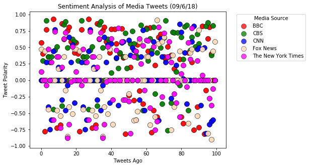
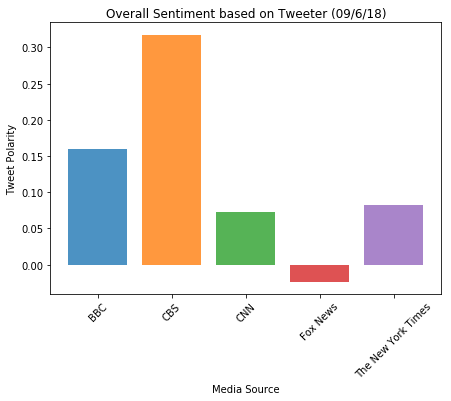

```python
#Import dependencies
import pandas as pd
import numpy as np
import tweepy
import matplotlib.pyplot as plt
import seaborn as sns
from datetime import datetime
import requests

# Twitter API Keys
from config import (consumer_key,consumer_secret,access_token,access_token_secret)
import json
```


```python
#vader sentiment
from vaderSentiment.vaderSentiment import SentimentIntensityAnalyzer
analyzer = SentimentIntensityAnalyzer()
```


```python
#OAuthHandler
auth = tweepy.OAuthHandler(consumer_key, consumer_secret)
auth.set_access_token(access_token, access_token_secret)
api = tweepy.API(auth, parser=tweepy.parsers.JSONParser())
```


```python
target_users = ['@BBC','@CBS','@CNN','@FoxNews','@nytimes']
```


```python
# For holiding the results
sentiment = []
```


```python
# loop through each news provider
for user in target_users:
    
    counter = 0
    
    # loop through 10 pages of tweets to grab 100 tweets for each news provider
    for x in range(5):
    
        # Get all tweets from home feed
        public_tweets = api.user_timeline(id=user,page = x)
    
        # loop through all the tweets
        for tweet in public_tweets:
            
            # run varder analysis on each tweet text
            results = analyzer.polarity_scores(tweet['text'])
            compound = results['compound']
            negative = results['neg']
            neutral = results['neu']
            positive = results['pos']
            
            # add results to array
            sentiment.append({"text":tweet['text'],
                              "sentiment_compound":compound,
                              "sentiment_negative":negative,
                              "sentiment_neutral" :neutral,
                              "sentiment_positive":positive,
                              "created_at":tweet['created_at'],
                              "tweets_ago":counter,
                              "name":tweet["user"]['name'],
                              "screen_name":tweet["user"]['screen_name']})
            counter += 1
```


```python
# convert the sentiment array to a dataframe
sentiments_pd = pd.DataFrame.from_dict(sentiment)
```


```python
# inspect the dataframe
sentiments_pd.head()
```


<div>
<style scoped>
    .dataframe tbody tr th:only-of-type {
        vertical-align: middle;
    }

    .dataframe tbody tr th {
        vertical-align: top;
    }

    .dataframe thead th {
        text-align: right;
    }
</style>
<table border="1" class="dataframe">
  <thead>
    <tr style="text-align: right;">
      <th></th>
      <th>created_at</th>
      <th>name</th>
      <th>screen_name</th>
      <th>sentiment_compound</th>
      <th>sentiment_negative</th>
      <th>sentiment_neutral</th>
      <th>sentiment_positive</th>
      <th>text</th>
      <th>tweets_ago</th>
    </tr>
  </thead>
  <tbody>
    <tr>
      <th>0</th>
      <td>Sat Jun 09 17:01:05 +0000 2018</td>
      <td>BBC</td>
      <td>BBC</td>
      <td>0.5719</td>
      <td>0.000</td>
      <td>0.829</td>
      <td>0.171</td>
      <td>One hundred years after some women won the rig...</td>
      <td>0</td>
    </tr>
    <tr>
      <th>1</th>
      <td>Sat Jun 09 16:04:03 +0000 2018</td>
      <td>BBC</td>
      <td>BBC</td>
      <td>0.4019</td>
      <td>0.156</td>
      <td>0.623</td>
      <td>0.222</td>
      <td>A year on from the Grenfell Tower fire, Sean a...</td>
      <td>1</td>
    </tr>
    <tr>
      <th>2</th>
      <td>Sat Jun 09 15:02:02 +0000 2018</td>
      <td>BBC</td>
      <td>BBC</td>
      <td>-0.7783</td>
      <td>0.327</td>
      <td>0.673</td>
      <td>0.000</td>
      <td>One shocking day of sexual violence from the p...</td>
      <td>2</td>
    </tr>
    <tr>
      <th>3</th>
      <td>Sat Jun 09 14:04:02 +0000 2018</td>
      <td>BBC</td>
      <td>BBC</td>
      <td>0.7717</td>
      <td>0.000</td>
      <td>0.472</td>
      <td>0.528</td>
      <td>❤️️ This is what love looks like. https://t.co...</td>
      <td>3</td>
    </tr>
    <tr>
      <th>4</th>
      <td>Sat Jun 09 13:24:03 +0000 2018</td>
      <td>BBC</td>
      <td>BBC</td>
      <td>0.3612</td>
      <td>0.000</td>
      <td>0.815</td>
      <td>0.185</td>
      <td>😆 @ChanningTatum and @UsainBolt have all the m...</td>
      <td>4</td>
    </tr>
  </tbody>
</table>
</div>


```python
# timestamp of the latest tweet
created_at_dt = []

for item in sentiments_pd['created_at']:
    x = datetime.strptime(item,"%a %b %d %H:%M:%S %z %Y")
    created_at_dt.append(x)
    
date = datetime.strftime(max(created_at_dt),"%d/%-m/%y")


```


```python
# create the scatter plot
color_names = ["r", "g", "b", "peachpuff", "fuchsia"]
plt.figure(figsize=(7,5))

counter = 0

group = sentiments_pd.groupby('name')

# loop through each target user
for item in group.groups.keys():

    df = sentiments_pd[sentiments_pd['name'] == item]
    plt.scatter(        
            x=df['tweets_ago'],
            y=df['sentiment_compound'],
            c = color_names[counter],
            s = 100,
            label = item,
            alpha=0.75,
            edgecolor='black',
            linewidth='0.5')
    counter += 1
    
# graph properties
plt.legend(title="Media Source",bbox_to_anchor=(1.04,1), loc="upper left")
plt.xlabel("Tweets Ago")
plt.ylabel("Tweet Polarity")
plt.title(f"Sentiment Analysis of Media Tweets ({date})")
plt.savefig("scatter.png", bbox_inches='tight')
plt.show();
```





```python
# get the overall sentiment per media and store it in a dataframe
sentiment_overall = sentiments_pd.groupby('name').agg({'sentiment_compound': np.mean}).reset_index()
sentiment_overall
```


<div>
<style scoped>
    .dataframe tbody tr th:only-of-type {
        vertical-align: middle;
    }

    .dataframe tbody tr th {
        vertical-align: top;
    }

    .dataframe thead th {
        text-align: right;
    }
</style>
<table border="1" class="dataframe">
  <thead>
    <tr style="text-align: right;">
      <th></th>
      <th>name</th>
      <th>sentiment_compound</th>
    </tr>
  </thead>
  <tbody>
    <tr>
      <th>0</th>
      <td>BBC</td>
      <td>0.159925</td>
    </tr>
    <tr>
      <th>1</th>
      <td>CBS</td>
      <td>0.317799</td>
    </tr>
    <tr>
      <th>2</th>
      <td>CNN</td>
      <td>0.072833</td>
    </tr>
    <tr>
      <th>3</th>
      <td>Fox News</td>
      <td>-0.023490</td>
    </tr>
    <tr>
      <th>4</th>
      <td>The New York Times</td>
      <td>0.081808</td>
    </tr>
  </tbody>
</table>
</div>


```python
# create the bar plot
plt.figure(figsize=(7,5))
counter = 0

# loop through each target user
for xtick in range(len(sentiment_overall)):
    plt.bar(xtick,
            height=sentiment_overall['sentiment_compound'][counter],
            label =sentiment_overall['name'][counter],
            alpha=0.8)
    counter += 1

# incorporate other graph properties
x_pos = [item for item in range(len(sentiment_overall))]
bar_labels = sentiment_overall['name']
plt.xticks(x_pos,bar_labels,rotation='45')
plt.ylabel("Tweet Polarity")
plt.xlabel("Media Source")
plt.title(f"Overall Sentiment based on Tweeter ({date})")
plt.savefig("bar.png", bbox_inches='tight')
plt.show();
```





```python
sentiments_pd.to_csv('data.csv')
```


```python
#Observations
#On average, The Fox News tweets were the most negative.
#On average, The New York Times & CNN tweets were the most neutral.
#On average, CBS tweets had more the most positive tweets.
```
