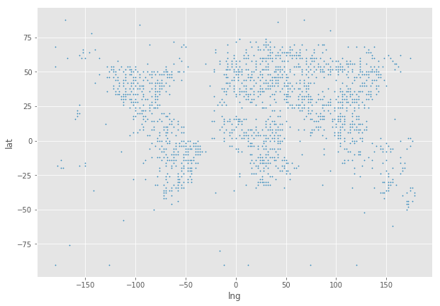
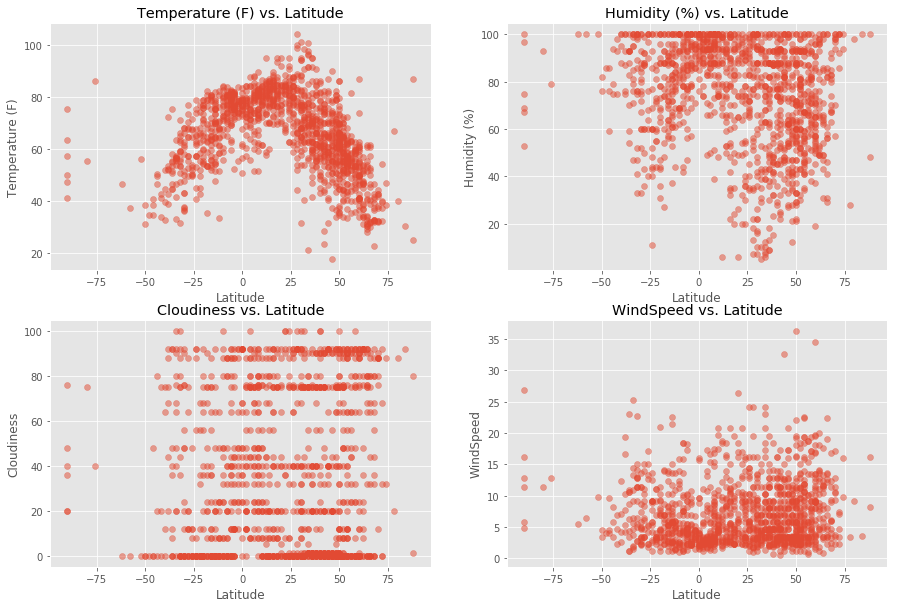
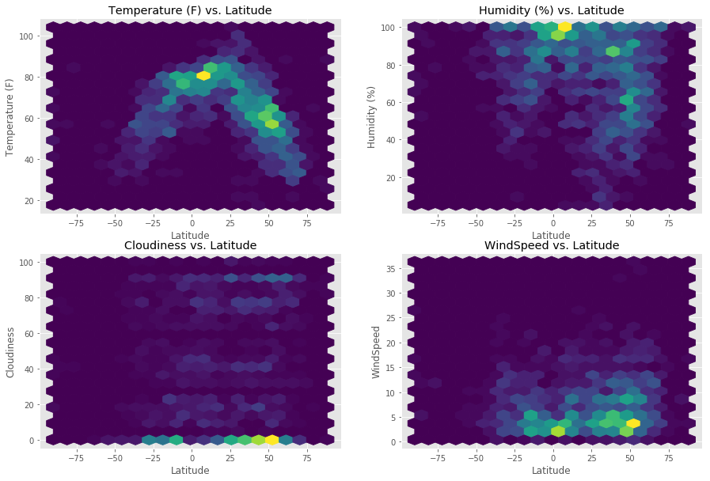

```python
#import dependencies
from citipy import citipy
import requests
import json
from config import openweather_api_key
import pandas as pd
import numpy as np
import matplotlib.pyplot as plt
plt.style.use('ggplot')
```


```python
# create a list of possible interger values for both lat and long
latitude = list(range(-90,90,2))
longitude = list(range(-180,180,2))
```


```python
# create a list of all the possible combinations of lat,long integer values
cities = []

for lng in longitude:
    for lat in latitude:
        cities.append({"lat":lat,"lng":lng})
```


```python
# convert the list to a dataframe
cities_df = pd.DataFrame(cities)
cities_df.head()
```


<div>
<style scoped>
    .dataframe tbody tr th:only-of-type {
        vertical-align: middle;
    }

    .dataframe tbody tr th {
        vertical-align: top;
    }

    .dataframe thead th {
        text-align: right;
    }
</style>
<table border="1" class="dataframe">
  <thead>
    <tr style="text-align: right;">
      <th></th>
      <th>lat</th>
      <th>lng</th>
    </tr>
  </thead>
  <tbody>
    <tr>
      <th>0</th>
      <td>-90</td>
      <td>-180</td>
    </tr>
    <tr>
      <th>1</th>
      <td>-88</td>
      <td>-180</td>
    </tr>
    <tr>
      <th>2</th>
      <td>-86</td>
      <td>-180</td>
    </tr>
    <tr>
      <th>3</th>
      <td>-84</td>
      <td>-180</td>
    </tr>
    <tr>
      <th>4</th>
      <td>-82</td>
      <td>-180</td>
    </tr>
  </tbody>
</table>
</div>


```python
# create a column for the nearest_city
cities_df['nearest_city_cityname']=""
cities_df['nearest_city_countrycode']=""
cities_df = cities_df.reset_index(drop=True)
```


```python
for index,row in cities_df.iterrows():
    city = citipy.nearest_city(row['lat'], row['lng'])
    cities_df.set_value(index,'nearest_city_cityname',city.city_name)
    cities_df.set_value(index,'nearest_city_countrycode',city.country_code)
```

    /Users/nicholashebert/anaconda3/lib/python3.6/site-packages/ipykernel/__main__.py:3: FutureWarning: set_value is deprecated and will be removed in a future release. Please use .at[] or .iat[] accessors instead
      app.launch_new_instance()
    /Users/nicholashebert/anaconda3/lib/python3.6/site-packages/ipykernel/__main__.py:4: FutureWarning: set_value is deprecated and will be removed in a future release. Please use .at[] or .iat[] accessors instead


```python
# drop duplicate city and country values 
cities_df = cities_df.drop_duplicates(['nearest_city_cityname','nearest_city_countrycode'],keep='first')
cities_df.shape
```


    (3512, 4)


```python
# Sample of 1500 entries
cities_df = cities_df.sample(n=1500)
cities_df = cities_df.reset_index(drop=True)
```


```python
cities_df.plot('lng','lat',kind='scatter',s=1.5,figsize=(10,7))
plt.show()
```





```python
cities_df["Temp"]=""
cities_df["Humidity"]=""
cities_df["Cloudiness"]=""
cities_df["WindSpeed"]=""
cities_df["DT"]=""

#counter
row_count = 0    
    
for index,row in cities_df.iterrows(): 
    
     # base url
    base_url = "http://api.openweathermap.org/data/2.5/weather"
    city = row['nearest_city_cityname']
    country = row['nearest_city_countrycode']
    units = "imperial"
    mode = "json"
    
    # configuration
    params = {
        "q" : f"{city},{country}",
        "units" : units,
        "appid" : openweather_api_key,
        "mode"  : mode
    }

    # request the url
    response = requests.get(base_url, params=params)
    
    # print log the requests
    if index%50 == 0:
        print("Now retrieving city #:" + str(row_count))
        print("http://api.openweathermap.org/data/2.5/weather?q=%s&units=%s&appid=%s&mode=%s" % (f"{city},{country}","imperial","xxxx",mode))   
    row_count += 1
    
    try:
        city_temp = response.json()["main"]["temp"]  
    except KeyError:
        city_temp = np.nan
    cities_df.set_value(index,"Temp",city_temp)
        
    try:
        city_humidity = response.json()["main"]['humidity']
    except KeyError:
        city_humidity = np.nan
    cities_df.set_value(index,"Humidity",city_humidity )
        
    try:
        city_cloudiness = response.json()["clouds"]['all']
    except KeyError:
        city_cloudiness = np.nan
    cities_df.set_value(index,"Cloudiness", city_cloudiness)

    try:
        city_windspeed = response.json()["wind"]["speed"]
    except KeyError:
        city_windspeed = np.nan
    cities_df.set_value(index,"WindSpeed",city_windspeed)

    try:
        city_dt = response.json()["dt"]
    except KeyError:
        city_dt = np.nan
    cities_df.set_value(index,"DT",city_dt)
```

    Now retrieving city #:0
    http://api.openweathermap.org/data/2.5/weather?q=lugovoy,ru&units=imperial&appid=xxxx&mode=json


    /Users/nicholashebert/anaconda3/lib/python3.6/site-packages/ipykernel/__main__.py:40: FutureWarning: set_value is deprecated and will be removed in a future release. Please use .at[] or .iat[] accessors instead
    /Users/nicholashebert/anaconda3/lib/python3.6/site-packages/ipykernel/__main__.py:46: FutureWarning: set_value is deprecated and will be removed in a future release. Please use .at[] or .iat[] accessors instead
    /Users/nicholashebert/anaconda3/lib/python3.6/site-packages/ipykernel/__main__.py:52: FutureWarning: set_value is deprecated and will be removed in a future release. Please use .at[] or .iat[] accessors instead
    /Users/nicholashebert/anaconda3/lib/python3.6/site-packages/ipykernel/__main__.py:58: FutureWarning: set_value is deprecated and will be removed in a future release. Please use .at[] or .iat[] accessors instead
    /Users/nicholashebert/anaconda3/lib/python3.6/site-packages/ipykernel/__main__.py:64: FutureWarning: set_value is deprecated and will be removed in a future release. Please use .at[] or .iat[] accessors instead


    Now retrieving city #:50
    http://api.openweathermap.org/data/2.5/weather?q=shilka,ru&units=imperial&appid=xxxx&mode=json
    Now retrieving city #:100
    http://api.openweathermap.org/data/2.5/weather?q=leningradskiy,tj&units=imperial&appid=xxxx&mode=json
    Now retrieving city #:150
    http://api.openweathermap.org/data/2.5/weather?q=karamea,nz&units=imperial&appid=xxxx&mode=json
    Now retrieving city #:200
    http://api.openweathermap.org/data/2.5/weather?q=peterhead,gb&units=imperial&appid=xxxx&mode=json
    Now retrieving city #:250
    http://api.openweathermap.org/data/2.5/weather?q=jarjis,tn&units=imperial&appid=xxxx&mode=json
    Now retrieving city #:300
    http://api.openweathermap.org/data/2.5/weather?q=shestakovo,ru&units=imperial&appid=xxxx&mode=json
    Now retrieving city #:350
    http://api.openweathermap.org/data/2.5/weather?q=sarkand,kz&units=imperial&appid=xxxx&mode=json
    Now retrieving city #:400
    http://api.openweathermap.org/data/2.5/weather?q=kyren,ru&units=imperial&appid=xxxx&mode=json
    Now retrieving city #:450
    http://api.openweathermap.org/data/2.5/weather?q=havelock,us&units=imperial&appid=xxxx&mode=json
    Now retrieving city #:500
    http://api.openweathermap.org/data/2.5/weather?q=tres lagoas,br&units=imperial&appid=xxxx&mode=json
    Now retrieving city #:550
    http://api.openweathermap.org/data/2.5/weather?q=khasan,ru&units=imperial&appid=xxxx&mode=json
    Now retrieving city #:600
    http://api.openweathermap.org/data/2.5/weather?q=manitowoc,us&units=imperial&appid=xxxx&mode=json
    Now retrieving city #:650
    http://api.openweathermap.org/data/2.5/weather?q=dawei,mm&units=imperial&appid=xxxx&mode=json
    Now retrieving city #:700
    http://api.openweathermap.org/data/2.5/weather?q=high point,us&units=imperial&appid=xxxx&mode=json
    Now retrieving city #:750
    http://api.openweathermap.org/data/2.5/weather?q=merauke,id&units=imperial&appid=xxxx&mode=json
    Now retrieving city #:800
    http://api.openweathermap.org/data/2.5/weather?q=shiyan,cn&units=imperial&appid=xxxx&mode=json
    Now retrieving city #:850
    http://api.openweathermap.org/data/2.5/weather?q=carnarvon,za&units=imperial&appid=xxxx&mode=json
    Now retrieving city #:900
    http://api.openweathermap.org/data/2.5/weather?q=anshun,cn&units=imperial&appid=xxxx&mode=json
    Now retrieving city #:950
    http://api.openweathermap.org/data/2.5/weather?q=vieux-habitants,gp&units=imperial&appid=xxxx&mode=json
    Now retrieving city #:1000
    http://api.openweathermap.org/data/2.5/weather?q=stilling,dk&units=imperial&appid=xxxx&mode=json
    Now retrieving city #:1050
    http://api.openweathermap.org/data/2.5/weather?q=udayagiri,in&units=imperial&appid=xxxx&mode=json
    Now retrieving city #:1100
    http://api.openweathermap.org/data/2.5/weather?q=la rioja,ar&units=imperial&appid=xxxx&mode=json
    Now retrieving city #:1150
    http://api.openweathermap.org/data/2.5/weather?q=jatai,br&units=imperial&appid=xxxx&mode=json
    Now retrieving city #:1200
    http://api.openweathermap.org/data/2.5/weather?q=excelsior springs,us&units=imperial&appid=xxxx&mode=json
    Now retrieving city #:1250
    http://api.openweathermap.org/data/2.5/weather?q=tyrma,ru&units=imperial&appid=xxxx&mode=json
    Now retrieving city #:1300
    http://api.openweathermap.org/data/2.5/weather?q=crixas,br&units=imperial&appid=xxxx&mode=json
    Now retrieving city #:1350
    http://api.openweathermap.org/data/2.5/weather?q=juruti,br&units=imperial&appid=xxxx&mode=json
    Now retrieving city #:1400
    http://api.openweathermap.org/data/2.5/weather?q=khandyga,ru&units=imperial&appid=xxxx&mode=json
    Now retrieving city #:1450
    http://api.openweathermap.org/data/2.5/weather?q=lukovetskiy,ru&units=imperial&appid=xxxx&mode=json


```python
#save 
cities_df.to_csv("cities_weather.csv", encoding="utf-8", index=False)
```


```python
# rename the columns
cities_df.columns = ['Lat', 'Lng', 'City', 'Country',
       'Temp', 'Humidity', 'Cloudiness', 'WindSpeed', 'Date']

# drop the null values
cities_df.dropna(axis=0,how='any',inplace=True)

#shape of the new dataframe
cities_df.shape
```


    (1320, 9)


```python
#Now plot
```


```python
# Scatter plot for Temperature (F) vs. Latitude
fig, ax = plt.subplots(nrows=2, ncols=2,figsize=(15,10))

df=cities_df[['Lng','Lat','Temp']]
df.columns = ['a', 'b', 'value']
ax1 = ax[0,0]

X = df.a.values
Y = df.b.values
Z = df.value.values

ax1.scatter(Y,Z,alpha=0.5)
ax1.set_title("Temperature (F) vs. Latitude")
ax1.set_xlabel("Latitude")
ax1.set_ylabel("Temperature (F)");

# Scatter plot for Humidity (%) vs. Latitude
df=cities_df[['Lng','Lat','Humidity']]
df.columns = ['a', 'b', 'value']
ax2 = ax[0,1]

X = df.a.values
Y = df.b.values
Z = df.value.values

ax2.scatter(Y,Z,alpha=0.5)
ax2.set_title("Humidity (%) vs. Latitude")
ax2.set_xlabel("Latitude")
ax2.set_ylabel("Humidity (%)");

# Scatter plot for Cloudiness (%) vs. Latitude
df=cities_df[['Lng','Lat','Cloudiness']]
df.columns = ['a', 'b', 'value']
ax3 = ax[1,0]

X = df.a.values
Y = df.b.values
Z = df.value.values

ax3.scatter(Y,Z,alpha=0.5)
ax3.set_title("Cloudiness vs. Latitude")
ax3.set_xlabel("Latitude")
ax3.set_ylabel("Cloudiness");

# Scatter plot for Wind Speed (mph) vs. Latitude
df=cities_df[['Lng','Lat','WindSpeed']]
df.columns = ['a', 'b', 'value']
ax4 = ax[1,1]

X = df.a.values
Y = df.b.values
Z = df.value.values

ax4.scatter(Y,Z,alpha=0.5)
ax4.set_title("WindSpeed vs. Latitude")
ax4.set_xlabel("Latitude")
ax4.set_ylabel("WindSpeed");
```





```python
#Save
plt.savefig("scatter.png")
plt.show()
```


    <matplotlib.figure.Figure at 0x104f6cd68>


```python
# Scatter plot for Temperature (F) vs. Latitude
fig, ax = plt.subplots(nrows=2, ncols=2,figsize=(15,10))

df=cities_df[['Lng','Lat','Temp']]
df.columns = ['a', 'b', 'value']
ax1 = ax[0,0]

X = df.a.values
Y = df.b.values
Z = df.value.values

ax1.hexbin(Y,Z,gridsize=20)
ax1.set_title("Temperature (F) vs. Latitude")
ax1.set_xlabel("Latitude")
ax1.set_ylabel("Temperature (F)");

# Scatter plot for Humidity (%) vs. Latitude
df=cities_df[['Lng','Lat','Humidity']]
df.columns = ['a', 'b', 'value']
ax2 = ax[0,1]

X = df.a.values
Y = df.b.values
Z = df.value.values

ax2.hexbin(Y,Z,gridsize=20)
ax2.set_title("Humidity (%) vs. Latitude")
ax2.set_xlabel("Latitude")
ax2.set_ylabel("Humidity (%)");

# Scatter plot for Cloudiness (%) vs. Latitude
df=cities_df[['Lng','Lat','Cloudiness']]
df.columns = ['a', 'b', 'value']
ax3 = ax[1,0]

X = df.a.values
Y = df.b.values
Z = df.value.values

ax3.hexbin(Y,Z,gridsize=20)
ax3.set_title("Cloudiness vs. Latitude")
ax3.set_xlabel("Latitude")
ax3.set_ylabel("Cloudiness");

# Scatter plot for Wind Speed (mph) vs. Latitude
df=cities_df[['Lng','Lat','WindSpeed']]
df.columns = ['a', 'b', 'value']
ax4 = ax[1,1]

X = df.a.values
Y = df.b.values
Z = df.value.values

ax4.hexbin(Y,Z,gridsize=20)
ax4.set_title("WindSpeed vs. Latitude")
ax4.set_xlabel("Latitude")
ax4.set_ylabel("WindSpeed");
```





```python
plt.savefig("hexbin.png")
plt.show()
```


    <matplotlib.figure.Figure at 0x104f74ef0>


```python
#Observable Trends

#1: There is a clear relationship between the latitude nad the temperature, the closer to the equator you getm, the warmer it is.

#2:  It also looks like humidity is concentrated closest to the equator.

#3:  It looks like it is windier in the northern latitudes as well.
```
